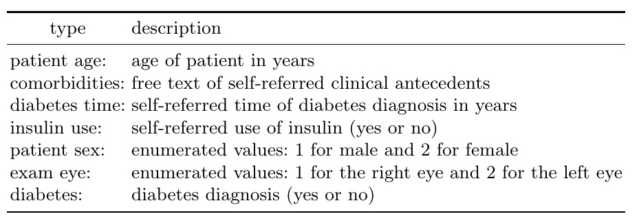

# BRSET
2D opthalmological color fundus images / tabular data (patient information)
classification of following 

##13 diseases:
diabetic retinopathy, 
macular edema, 
scar, 
nevus, 
amd, 
vascular occlusion, 
hypertensive retinopathy, 
drusens, 
hemorrhage, 
retinal detachment, 
myoptic fundus, 
increased cup disc, 
other. 

Another is for no finding.

## 2D example image:

Fig.: BRSET. Image img01468. Preprocessing for trainings routine. The source images were normalized with mean = [0.485, 0.456, 0.406] and std = [0.229, 0.224, 0.225]. Note that black parts in the transformed image inside the eye are still distinguishable by the model.

## tabular data:

Tab.: Tabular data in BRSET.

