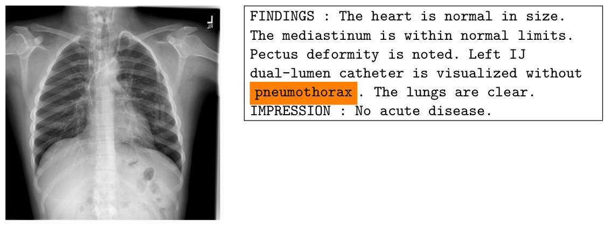
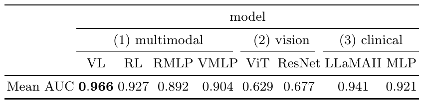

# Chest X-Ray
2D Chest X-Rays / clinical reports
classification of diseases

## 12 diseases:

atelectasis, 
cardiomegaly, 
consolidation, 
edema, 
enlarged cardiomediastinum, 
fracture, 
lung lesion, 
lung opacity, 
pleural effusion, 
pleural other, 
pneumonia, 
pneumothorax

one for Support Devices,
another one for no finding.

## Example item (2D image + clinical report):

Fig.: Chest X-Ray + Clinical Report. Example item CXR1897_IM-0581-1001. Disease: support devices. Orange words (labels) removed during the preprocessing step.

## Performance:

Performance AUC on image--text pair classification task, i.e. Chest X-Ray + clinical report, for (1) multimodal models, (2) vision (only) models and (3) clinical (only) models using the testing dataset.

