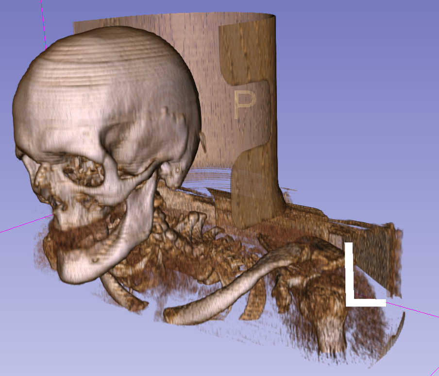
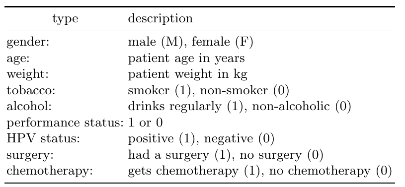
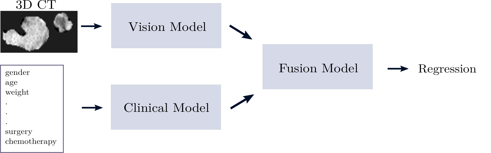

# HECKTOR 22
3D CT images (head and neck), tabular data (patient information)
regression, prediction of RFS times

## 3D rendered image (whole image uncropped):

## tabular data:

## Model:

## Performance:
Performance c-index on image--tabular regression task, viz. Hecktor 22, for (1) multimodal models, (2) vision (only) models and (3) clinical (only) models on the testing dataset. Here the results are for the RFS prediction, i.e. the observed class is label 1: relapse.

