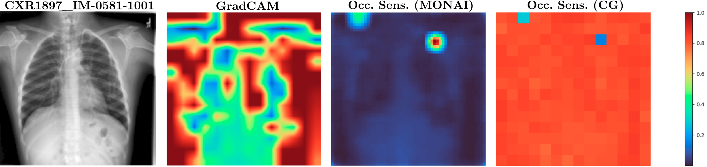
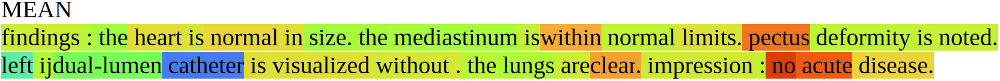
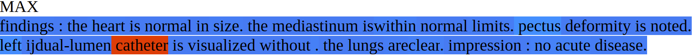

## Chest X-RAY

Fig.: CXR1897_IM-0581-1001: Correctly predicted disease: support devices. Modality contribution vision : text = 0.24 : 0.76. Model: ViTLLAMA II. From blue to red the contribution (low to high) from a single patch (vision) or word (text) to the task is highlighted. Top, left to right: source image, GradCAM, class specific Occlusion Sensitivity for class support devices (MONAI), Occlusion Sensitivity averaged over all classes (CG, i.e. *ours*). The red patch in the upper right area in image Occ. sens. (MONAI) has the highest contribution to the class support devices. The same area is colored blue in image Occ. sens. (CG), as this patch has the lowest average contribution to all classes.  Bottom: Text. MEAN: The words *no* and *acute* have the highest average contribution, *catheter* has the lowest. MAX: *catheter* has the highest contribution to one class: support devices.

## BRSET

