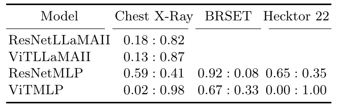

# Medical Tasks
For each medical task the .py source files are provided.
First the models are trained for the medical purposes. Secondly the models are analyzed regarding the performances (AUC for classification, c-index for regression). Finally the modality contribution metric is computed.
Altough the computation of the modality contribution is done in each folder (for each task),
we additionally provide the computation method in the Interpretability folder, 
together with some explanations.

Feel free to use the files in Interpretability for your own projects (analogously as done in the tasks here).

## BRSET
2D opthalmological color fundus images / tabular data (patient information)
classification of diseases

## ChestXRay
2D Chest X-Rays / clinical reports
classification of diseases

## Hecktor22
3D CT images (head and neck), tabular data (patient information)
regression, prediction of RFS times

## Overall results regarding modality contribution
Modality contribution specific for architecture and dataset. Entries quantify *m_0* to *m_1*, viz. vision : text (Chest X-Ray) and vision : tabular (BRSET, Hecktor 22). The computation was done on the testing datasets.

